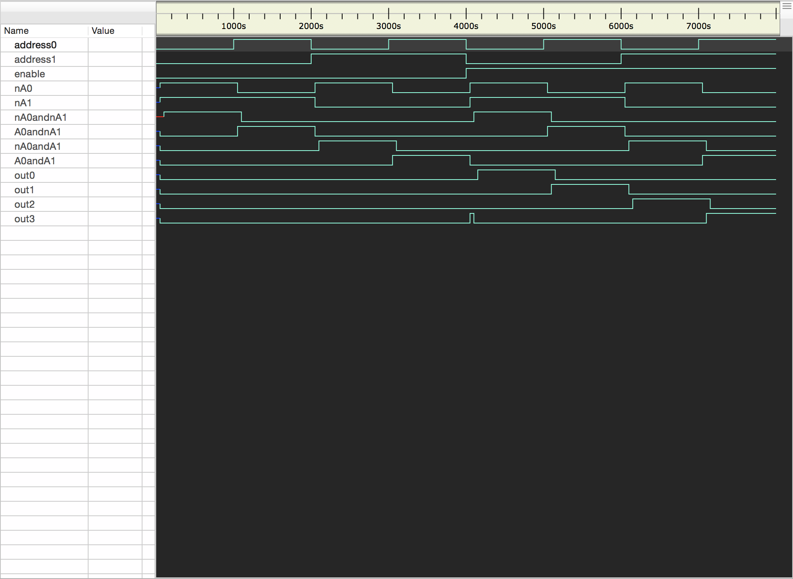
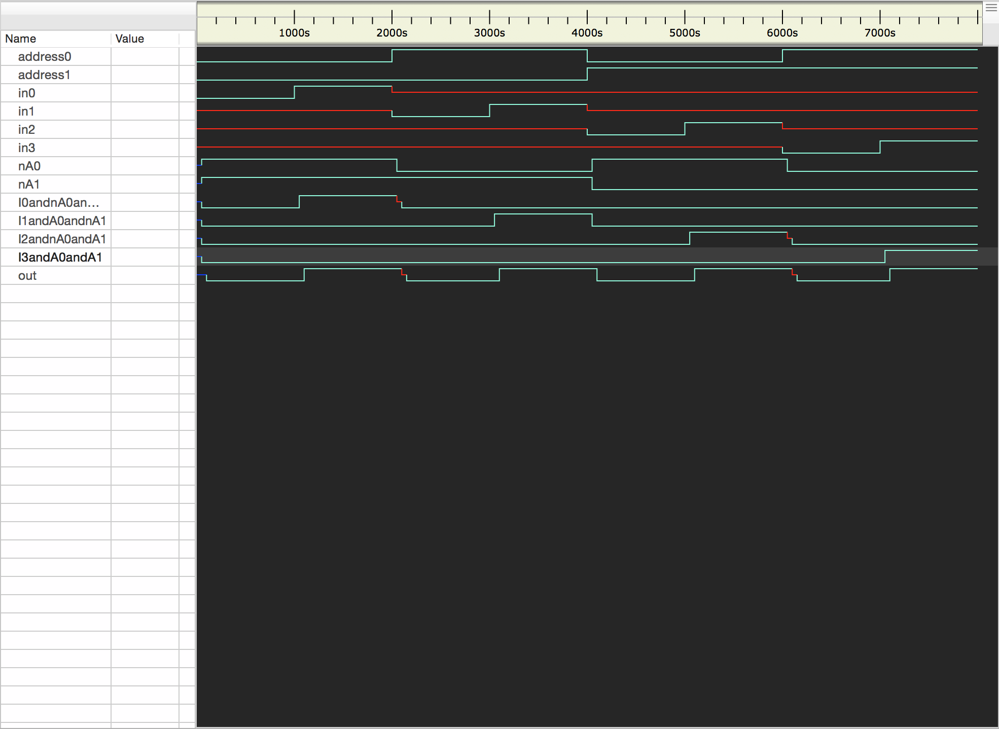
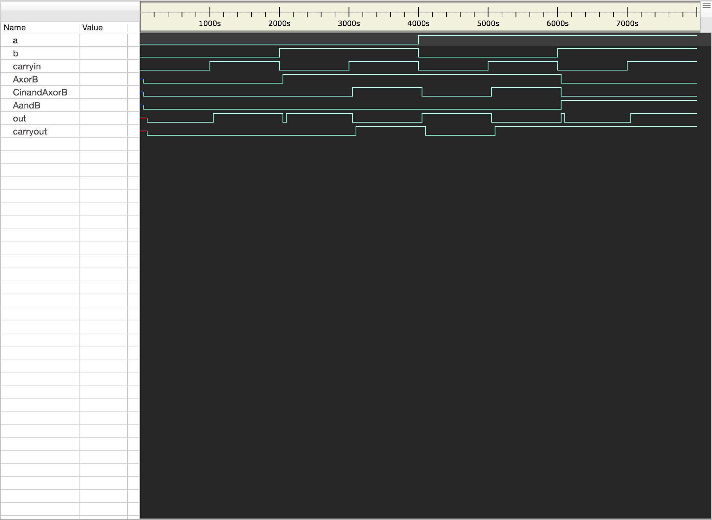

# Lab 2 Writeup
## How to Run
Run `bash run.sh` in terminal in the HW2 directory. Will create .vcd files and print the truth tables.

## Decoder
### Test Bench
```
En A0 A1| O0 O1 O2 O3 | Expected Output
0  0  0 |  0  0  0  0 | All false
0  1  0 |  0  0  0  0 | All false
0  0  1 |  0  0  0  0 | All false
0  1  1 |  0  0  0  0 | All false
1  0  0 |  1  0  0  0 | O0 Only
1  1  0 |  0  1  0  0 | O1 Only
1  0  1 |  0  0  1  0 | O2 Only
1  1  1 |  0  0  0  1 | O3 Only
```
### Waveforms



## Multiplexor

### Test Bench
```
A1 A0 | I3 I2 I1 I0 | Out | Expected Output
0  0  | x  x  x  0  |  0  | false
0  0  | x  x  x  1  |  1  | true
0  1  | x  x  0  x  |  0  | false
0  1  | x  x  1  x  |  1  | true
1  0  | x  0  x  x  |  0  | false
1  0  | x  1  x  x  |  1  | true
1  1  | 0  x  x  x  |  0  | false
1  1  | 1  x  x  x  |  1  | true
```
This test bench only shows 8 different inputs although there are actually 2<sup>6</sup> = 64 possible permutations of inputs. Only 8 are needed because A0 and A1 dictate which input (I0, I1, I2, I3) will be the output, and only the value of that input affects the value of the output. For example, take the first two rows of the truth table. When A1 and A0 read 00 (binary for d0), respectively, the output will reflect only the value of I0. In the third and fourth rows, A1 and A0 read 01 (binary for d1). The outputs for these rows reflect only the value of I1. The Xs in the truth table represent the fact that the value of those inputs will not affect the output, given the other inputs (basically, wherever there is an X, that input could be set to either high or low and would not affect the output).
### Waveforms



## Adder

### Test Bench
```
A B Cin | S Cout | Expected Output
0  0  0 | 0   0  | All false
0  0  1 | 1   0  | S only
0  1  0 | 1   0  | S only
0  1  1 | 0   1  | Cout only
1  0  0 | 1   0  | S only
1  0  1 | 0   1  | Cout only
1  1  0 | 0   1  | Cout only
1  1  1 | 1   1  | Both
```
### Waveforms

