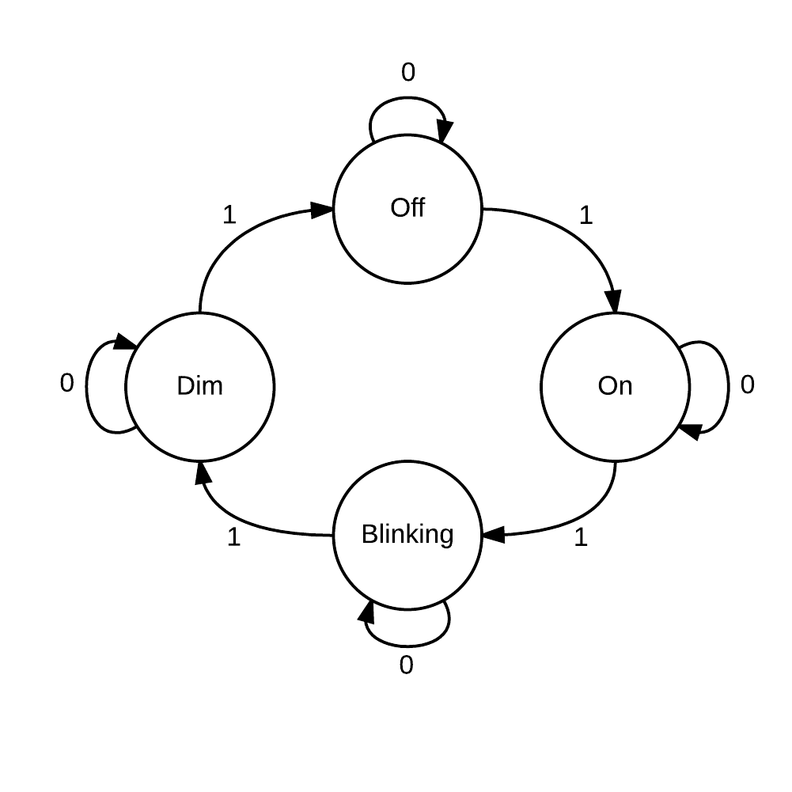

# 1.0 Specification Document for Bike Light
## Overview
This circuit is to be used in bike lights that have four different modes (explained later).

## 1.1 Inputs
This bike light circuit takes in input from a single button.

## 1.2 Outputs
This circuit outputs to a single LED.

## 1.3 Operational Modes
This bike light supports four different operational modes:
- Off:
  - The LED is off.
- On:
  - The LED is on.
- Blinking:
  - The LED switches between off and on.
- Dim:
  - The LED is on, but is dim.

The light changes to the next mode after every press of the button, as shown in the following finite state machine diagram (numbers on arrows show the next button input, where 1 is pressed and 0 not pressed):

## 1.4 Measurements
- Blinking frequency:
  - When in the blinking mode, the light switches between off and on at a frequency of 2Hz.
- Dim frequency:
  - PWM is used to dim the light. The LED switches between off and on at a 50% duty cycle for 128 Hz. 128 Hz was chosen because most sources ([source](http://physics.stackexchange.com/questions/19040/limit-of-human-eye-flicker-perception "source"), [other source](https://learn.sparkfun.com/tutorials/pulse-width-modulation "other source"), [another source](http://www.waitingforfriday.com/index.php/Controlling_LED_brightness_using_PWM "another source")) suggest that human eyes will usually detect 50% duty cycles as dimness rather than switching between off and on at frequencies of 100 Hz and greater.

# 2.0 Block Diagram

## 2.1 Overall Schematic

### 2.1.1 Parts
The overall top-level view of the circuit consists of a few main parts.
- System Clock
  - Provides a 32,768 Hz square wave. This clock is used throughout the circuit to provide timing.
- Input Conditioner
  - Conditions the button's input signal to get rid of noise and detect when the button is first pressed.
- Finite State Machine (FSM)
  - Used to calculate to which of the four states (described in section 1.3) the led should be set.
-  Frequency Divider
  - Takes in the clock signal of frequency f and outputs a signal that is some frequency f/2n, where n is given. Both the blinking and dim states use the frequency divider, but each with different values for n.
- 0 value
  - Used for the output of the off state.
- 1 value
  - Used for the output of the on state.
- 4 to 1 Multiplexer
  - Chooses what the LED should do based off of what state the FSM outputs.

### 2.1.2 Cost

| Subcomponent         | Cost per | # Used | Total |
| ----                 | ---      | ---    | ---   |
| System Clock         | 2        | 1      | 2     |
| Input Conditioner    | 175      | 1      | 175   |
| Finite State Machine | 25       | 1      | 25    |
| Frequency Divider    | 182      | 1      | 182   |
| 4 to 1 Multiplexer   | 23       | 1      | 23    |
|                      |          |        | 407   |

## 2.2 Component Schematic

See the Schematics section (below) to view more in depth schematics of components.

# 3.0 Schematic

## 3.1 Input Conditioner

### 3.1.1 Specification
The input conditioner takes in the clock and the raw, noisy button signal as inputs and calculates a conditioned version of the button input signal. Assuming button noise/debouncing decays within 1 millisecond, this input conditioner uses two synchronizing D flip flops and a counter to track if the raw input signal has been high for at least 1 millisecond. This 1 millisecond wait time is tracked by having the counter count to 5. Since the clock has a frequency of 32,768 Hz, its period is 1/215 seconds. Multiplying this period by 25 yields 0.0009765625 seconds, which is approximately 1 millisecond. The output is only the positive edge of the conditioned signal because if it were the conditioned signal itself, the FSM would quickly keep moving to the next state on the next clock cycle as long as conditioned were high. Just outputting the positive edge only allows the FSM to switch stages once per button press.

### 3.1.2 Inputs

Inputs **clk** as the clock signal and **input** as the noisy signal to condition.

### 3.1.3 Outputs

**positiveedge** is the positive rising edge from when the conditioned input signal first becomes high. This stays high for one clock cycle and then stays low until re-triggered by the conditioned signal becoming high again after going low.

### 3.1.4 Schematic

### 3.1.5 Cost

| Subcomponent                | Cost per | # Used | Total |
| ----                        | ---      | ---    | ---   |
| Positive Edge Triggered DFF | 13       | 4      | 52    |
| 2:1 Multiplexer             | 10       | 1      | 10    |
| 2 XOR                       | 2+1 = 3  | 1      | 3     |
| 2 AND                       | 2+1 = 3  | 2      | 6     |
| 5 Stage Ring Counter        | 21*5-1 = 104  | 1  | 104  |
|                             |          |        | 175   |

## 3.2 Finite State Machine

### 3.2.1 Specification

The finite state machine (FSM) allows rotation between four states. The state is encoded as a 2-bit binary number. The FSM functions similarly to a 2-bit adder, but with no carryout.

### 3.2.2 Inputs

**clk** is the clock input. **in** is the input which allows the FSM to decide which state to move to next. In the bike light, **in** is the output of the input conditioner.

### 3.2.3 Outputs

**state[0]** and **state[1]** are the least significant and most significant bits, respectively, of the binary encoded state (from b00 to b11).

### 3.2.4 Schematic

### 3.2.5 Cost

| Subcomponent                | Cost per | # Used | Total |
| ----                        | ---      | ---    | ---   |
| 2XOR                        | 2+1 = 3  | 2      | 6     |
| 2AND                        | 2+1 = 3  | 1      | 3     |
| Positive Edge Triggered DFF | 13       | 2      | 13    |
|                             |          |        | 25    |

## 3.3 Frequency Divider

### 3.3.1 Specification

The frequency divider divides the frequency of an input clock signal by 2n, where n is the number of positive edge triggered D flip flops being used. For the bike light, this is used both to set the frequency of the blinking state (2Hz) and is used as PWM to set the frequency for the dim state (128 Hz). Since the clock generates a frequency of 32,768 Hz, the blinking state takes output after the 14th dff (32,768 = 215, so 215/214 = 2), and the dim state takes output after the 8th dff (215/28 = 128).

### 3.3.2 Inputs

**clk** is the signal which will have its frequency divided by a power of 2.

### 3.3.3 Outputs

**f/28** is the output for the 2 Hz signal that is the frequency of the blinking state, while **f/214** is the output for the 128 Hz signal that is the frequency of the dim state.

### 3.3.4 Schematic

### 3.3.5 Cost

| Subcomponent                | Cost per | # Used | Total |
| ----                        | ---      | ---    | ---   |
| Positive Edge Triggered DFF | 13       | 14     | 182   |
|                             |          |        | 182   |

## 3.4 4 to 1 Bit Multiplexer

### 3.4.1 Specification

This is a mux which chooses, based off of a 2 bit binary decoded address, which of four input signals to output.

### 3.4.2 Inputs

**Addr0** and **Addr1** are the binary encoded address bits, while **in0**, **in1**, **in2**, and **in3** are the inputs being chosen from.

### 3.4.3 Outputs

**out** is the output signal.

### 3.4.4 Schematic

### 3.4.5 Cost

| Subcomponent     | Cost per | # Used | Total |
| ----             | ----     | ---    | ---   |
| Inverter         | 1        | 2      | 2     |
| 3AND             | 3+1 = 4  | 4      | 16    |
| 4OR              | 4+1 = 5  | 1      | 5     |
|                  |          |        | 23    |
